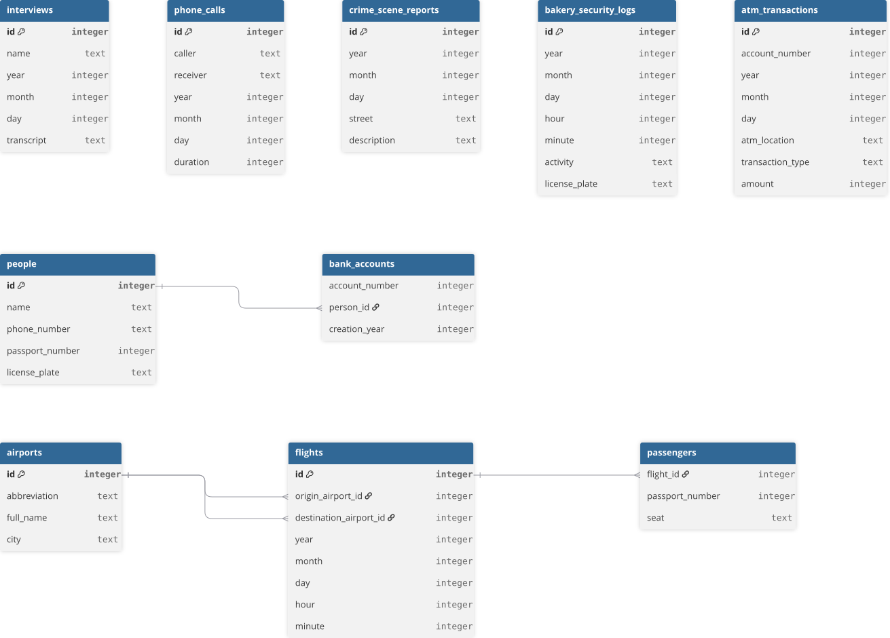

# solution-for-cs50x-Fiftyville
Solution for CS50x 2026 problem statement 'Fiftyville' of Week 8 'SQL' 

This repo is intended to share my thought process and solution for the problem statement.

- log.sql has SQL queries and comment to build the solution piece by piece rather than a single query. This problem statement was one of my favorites.

- answer.txt has the actual answers to the finding who the culprit and accomplise is, along with flight record.

- Also providing the .db, feel free to play around. :)

